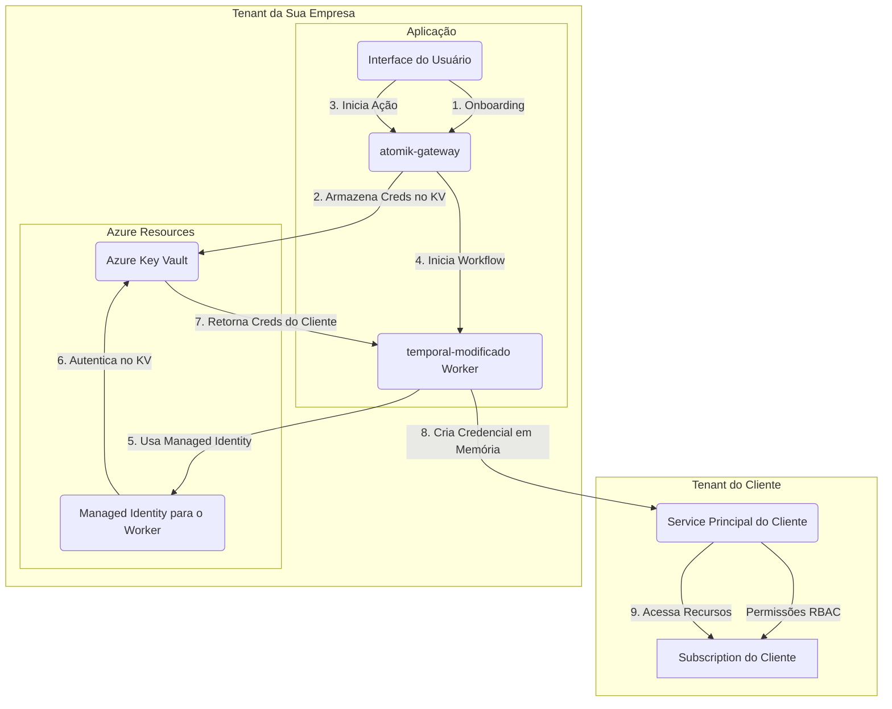

# Proposta de Arquitetura e Recomendações

## Análise da Situação Atual

Após a análise dos projetos `atomik-gateway` e `temporal-modificado`, bem como a pesquisa sobre as melhores práticas de segurança no Azure, apresento um resumo do cenário atual e uma proposta de arquitetura para atender aos seus requisitos de integração e gerenciamento seguro de credenciais.

### atomik-gateway

O projeto `atomik-gateway` funciona como um **serviço de fachada (backend-for-frontend)**, expondo uma API REST para a interface do usuário. Ele é responsável por:

- Autenticar e autorizar usuários via JWT.
- Listar e detalhar incidentes (consultando o MongoDB).
- Receber decisões do usuário (aprovar/negar) e, presumivelmente, iniciar ou interagir com workflows do Temporal.
- Implementar lógicas de negócio como idempotência e guardrails.

### temporal-modificado

O projeto `temporal-modificado` contém os **workers do Temporal**, que executam a lógica de negócio principal de forma assíncrona. Suas responsabilidades incluem:

- Executar workflows de orquestração de incidentes.
- Realizar atividades como consultar métricas no Azure (`queryKQL`), analisar dados, persistir informações e aplicar remediações.
- Atualmente, ele depende de um arquivo `.env` para obter as credenciais do Azure, o que representa um risco de segurança e não é uma prática escalável.

## Proposta de Arquitetura

A seguir, apresento a arquitetura ideal para integrar os dois sistemas e resolver o desafio do gerenciamento de credenciais de forma segura e escalável em um ambiente multi-tenant.

### Visão Geral da Arquitetura



### Fluxo de Dados e Interações

1.  **Onboarding do Cliente**: O cliente, através da sua interface, fornece as credenciais de um **Service Principal** que ele criou em seu próprio tenant do Azure. Este Service Principal deve ter as permissões (RBAC) necessárias para que seu workflow possa monitorar e aplicar as remediações nas subscriptions dele.

2.  **Armazenamento Seguro**: O `atomik-gateway` recebe essas credenciais (via HTTPS) e as armazena de forma segura como `secrets` individuais no **Azure Key Vault** da sua empresa. Cada secret pode ser nomeado com um identificador do cliente (ex: `cliente-a-client-secret`).

3.  **Início do Workflow**: Quando uma ação precisa ser executada (seja por uma decisão do usuário ou um gatilho automático), o `atomik-gateway` inicia um workflow no `temporal-modificado`, passando o identificador do cliente como parâmetro.

4.  **Autenticação do Worker**: O worker do `temporal-modificado`, ao executar uma atividade que precisa acessar a subscription do cliente, utilizará sua própria **Managed Identity** para se autenticar no Azure Key Vault da sua empresa. Isso elimina completamente a necessidade de armazenar qualquer tipo de credencial da sua própria empresa no código ou em arquivos de configuração.

5.  **Recuperação Just-in-Time**: Com a identidade gerenciada, o worker solicita ao Key Vault as credenciais do Service Principal do cliente específico. O Key Vault, validando a permissão da Managed Identity, retorna os secrets.

6.  **Acesso à Subscription do Cliente**: A atividade do Temporal, agora com as credenciais do cliente em memória, cria um `ClientSecretCredential` e o utiliza para se autenticar no tenant do cliente e executar as operações necessárias (ex: `queryKQL`, `applyRemediation`). As credenciais do cliente existem apenas na memória do worker e pelo tempo necessário para a execução da atividade.

## Gerenciamento de Credenciais Azure: A Solução Detalhada

Este é o ponto mais crítico da sua pergunta. A meta é que **SUA empresa não tenha acesso direto** às credenciais do cliente, garantindo segurança e confiança.

### Onde as Credenciais Ficam Armazenadas?

As credenciais do Service Principal do cliente ficarão armazenadas no **Azure Key Vault da sua empresa**. Isso pode parecer contraintuitivo à primeira vista, mas é a abordagem mais segura e padrão da indústria para aplicações SaaS multi-tenant. A segurança não vem de *onde* estão, mas de *como* são protegidas e acessadas.

| Modelo de Armazenamento | Vantagens | Desvantagens |
| :--- | :--- | :--- |
| **Azure Key Vault (Recomendado)** | Criptografia em repouso e trânsito, controle de acesso RBAC, auditoria completa, gerenciamento centralizado. | Requer configuração inicial de permissões. |
| Arquivo `.env` no Worker | Simples para desenvolvimento. | **Inseguro**, não escalável, credenciais expostas no filesystem, pesadelo de gerenciamento. |
| Banco de Dados | Centralizado. | Requer implementação de criptografia customizada, complexo de gerenciar chaves, menos seguro que Key Vault. |

### Como Garantir que "Nossa Empresa Não Tenha Acesso"?

O conceito de "não ter acesso" é alcançado através de uma combinação de controles técnicos e de processo:

1.  **Controle de Acesso (RBAC)**: Apenas a **Managed Identity** do seu worker do Temporal terá a permissão `get` para os secrets no Key Vault. Nenhum usuário, administrador ou outro serviço da sua organização terá essa permissão em produção. Isso significa que um desenvolvedor ou operador não pode simplesmente entrar no portal do Azure e ler o client secret do cliente.

2.  **Auditoria**: Todas as operações no Key Vault, incluindo a leitura de um secret, são registradas. Você pode monitorar e auditar exatamente quando e por quem (neste caso, pela Managed Identity do worker) um secret foi acessado.

3.  **Acesso Just-in-Time e em Memória**: As credenciais do cliente não ficam persistidas no worker. Elas são recuperadas do Key Vault no início de uma atividade, usadas para autenticação, e descartadas da memória ao final da execução. Elas nunca tocam o disco do worker.

4.  **Separação de Responsabilidades**: O cliente é responsável por criar e gerenciar o ciclo de vida do Service Principal em seu tenant. Ele pode revogar o acesso a qualquer momento simplesmente deletando ou rotacionando o secret do Service Principal, sem precisar de nenhuma ação da sua parte.

> **Citação da Microsoft sobre Managed Identities:**
> "Managed identities for Azure resources provides Azure services with an automatically managed identity in Microsoft Entra ID. You can use the identity to authenticate to any service that supports Microsoft Entra authentication, including Key Vault, without having any credentials in your code." [1]

## Plano de Implementação Sugerido

### 1. Modificar `temporal-modificado` para Remover `.env`

No seu `temporal-modificado`, substitua o uso de `process.env` para credenciais do Azure pela seguinte lógica:

**`src/services/customerAzureAuth.ts` (Novo arquivo)**

```typescript
import { ClientSecretCredential } from '@azure/identity';
import { SecretClient } from '@azure/keyvault-secrets';
import { DefaultAzureCredential } from '@azure/identity';

// Use DefaultAzureCredential para autenticar no Key Vault via Managed Identity
const keyVaultUrl = process.env.KEY_VAULT_URL!;
const credential = new DefaultAzureCredential();
const secretClient = new SecretClient(keyVaultUrl, credential);

// Cache de credenciais em memória para reutilização dentro de um workflow
const credentialCache = new Map<string, ClientSecretCredential>();

export async function getCustomerAzureCredential(tenantId: string, customerId: string): Promise<ClientSecretCredential> {
  const cacheKey = `${tenantId}-${customerId}`;
  if (credentialCache.has(cacheKey)) {
    return credentialCache.get(cacheKey)!;
  }

  // Nomes dos secrets no Key Vault (ex: customer-abc-client-id)
  const clientIdSecretName = `customer-${customerId}-client-id`;
  const clientSecretSecretName = `customer-${customerId}-client-secret`;

  const [clientId, clientSecret] = await Promise.all([
    secretClient.getSecret(clientIdSecretName),
    secretClient.getSecret(clientSecretSecretName),
  ]);

  if (!clientId.value || !clientSecret.value) {
    throw new Error(`Credenciais não encontradas para o cliente ${customerId}`);
  }

  const customerCredential = new ClientSecretCredential(
    tenantId,
    clientId.value,
    clientSecret.value
  );

  credentialCache.set(cacheKey, customerCredential);
  return customerCredential;
}
```

Nas suas `activities`, você chamaria `getCustomerAzureCredential` passando o `tenantId` e `customerId` recebidos no workflow para obter a credencial necessária para interagir com a subscription do cliente.

### 2. Integrar a API do `atomik-gateway`

A integração da API não deve ser feita "dentro" do código do `temporal-modificado`. O `atomik-gateway` deve permanecer como um serviço separado que **inicia** os workflows. A comunicação entre eles é feita através do Temporal Client.

**Exemplo em `incidents.controller.ts` no `atomik-gateway`:**

```typescript
// ... dentro de uma função de controller, ex: decisionCtrl

import { getTemporalClient } from '../services/temporal'; // Serviço que inicializa e retorna o client

// ...

const client = await getTemporalClient();

// Iniciar o workflow de remediação após uma aprovação
if (action === 'approve') {
  await client.workflow.start('IncidentRemediationWorkflow', {
    args: [
      {
        incidentId: incident.id,
        customerId: incident.customerId, // Supondo que o ID do cliente está no incidente
        tenantId: incident.tenantId,
        targetRU: body.targetRU
      }
    ],
    taskQueue: 'atomik-incidents',
    workflowId: `remediation-${incident.id}`,
  });
}

// ...
```

### 3. Configuração do Azure

1.  **Habilitar Managed Identity**: No recurso Azure onde seu worker do `temporal-modificado` está rodando (ex: App Service, VM, AKS), habilite a System-Assigned Managed Identity.
2.  **Criar Azure Key Vault**: Provisione um Key Vault na sua subscription.
3.  **Configurar Access Policy no Key Vault**: Vá até o Key Vault, em "Access policies", e crie uma política que concede à Managed Identity do seu worker as permissões de `Get` e `List` para `Secrets`.
4.  **Variável de Ambiente**: A única variável de ambiente relacionada a segredos que seu worker precisará é a URL do Key Vault (`KEY_VAULT_URL`).

## Conclusão e Recomendações

- **NÃO mescle os projetos**. Mantenha a separação de responsabilidades: `atomik-gateway` como a camada de API/interação e `temporal-modificado` como a camada de execução de workflows.
- **NÃO use `.env` em produção**. Adote a arquitetura proposta com Azure Key Vault e Managed Identity para um gerenciamento de segredos robusto e seguro.
- **Armazene as credenciais dos clientes no SEU Key Vault**. A segurança é garantida pelo controle de acesso rigoroso (RBAC) e pela auditoria, não pela localização física dos secrets.
- **Use o padrão Service Principal por Cliente**. É a forma correta e segura para uma aplicação SaaS acessar recursos em tenants de clientes.
- **Implemente o fluxo de autenticação via Managed Identity** no seu worker para acessar o Key Vault. Isso elimina a necessidade de gerenciar os segredos da sua própria infraestrutura.

Seguir esta abordagem não apenas resolve seus requisitos técnicos, mas também implementa um padrão de segurança moderno e confiável, que é fundamental para construir a confiança dos seus clientes.

---

### Referências

[1] Microsoft Learn. *Managed identities for Azure resources*. [https://learn.microsoft.com/en-us/azure/active-directory/managed-identities-azure-resources/overview](https://learn.microsoft.com/en-us/azure/active-directory/managed-identities-azure-resources/overview)

[2] Microsoft Learn. *Best practices for protecting secrets*. [https://learn.microsoft.com/en-us/azure/security/fundamentals/secrets-best-practices](https://learn.microsoft.com/en-us/azure/security/fundamentals/secrets-best-practices)

[3] Microsoft Learn. *About Azure Key Vault secrets*. [https://learn.microsoft.com/en-us/azure/key-vault/secrets/about-secrets](https://learn.microsoft.com/en-us/azure/key-vault/secrets/about-secrets)
